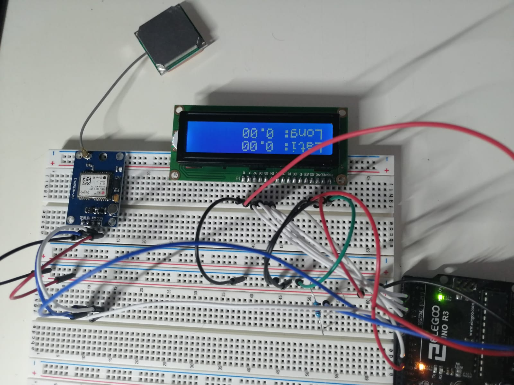

# trackerGps

Il prototipo di un mini tracker GPS dormiente che possa risvegliarsi a seguito della ricezione di un segnale di risveglio che verrà dato via Wi-FI/BLE E/oppure da un cambio di temperatura ( Immaginiamo un motore di una macchina che si avvia e mano mano si scalda) e l'informazione della posizione verra' mostrata su un display.

Idealmente un mini tracker GPS dormiente che possa risvegliarsi a seguito di un segnale  di qualche sorta come ad esempio un SMS e quindi rispondere inviando le coordinate GPS attuali della posizione. 

## Componenti utilizzate

- ESP32
- Termistore
- LCD1602
- Modulo GPS NEO6MV2

## Licenza
GPLv3

 
 
 
